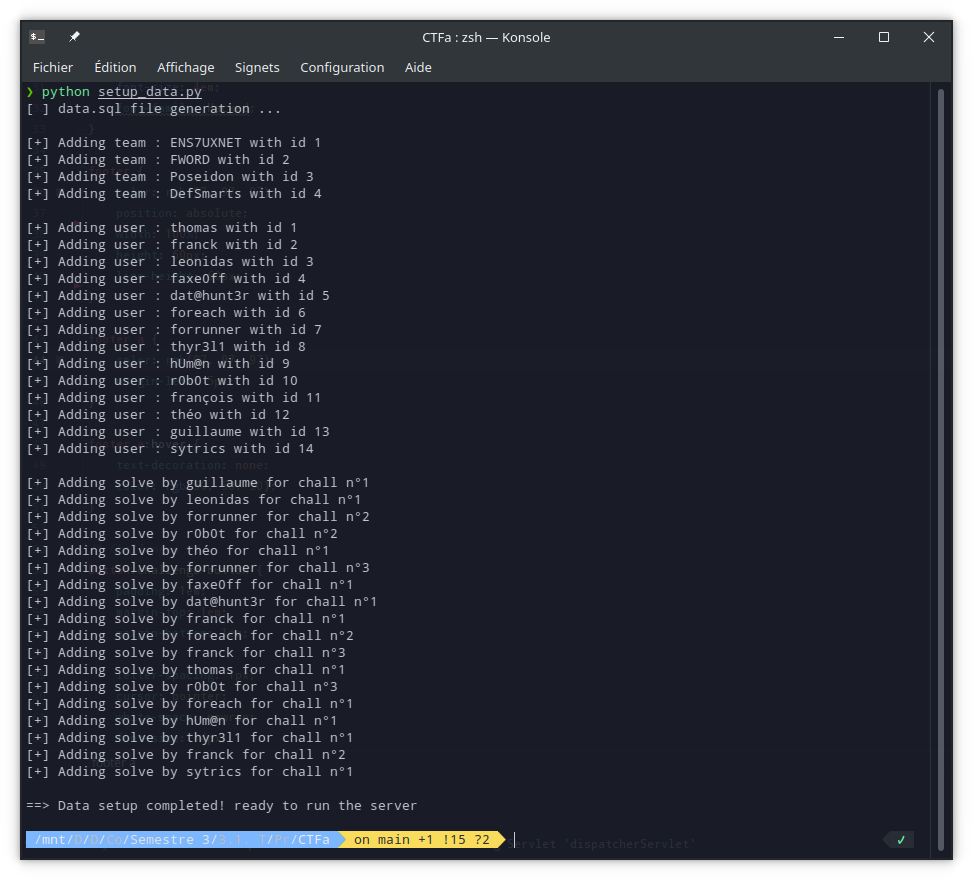
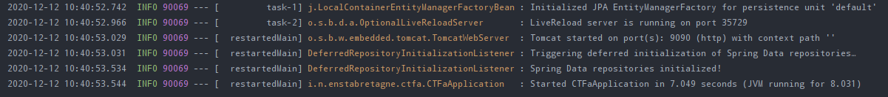
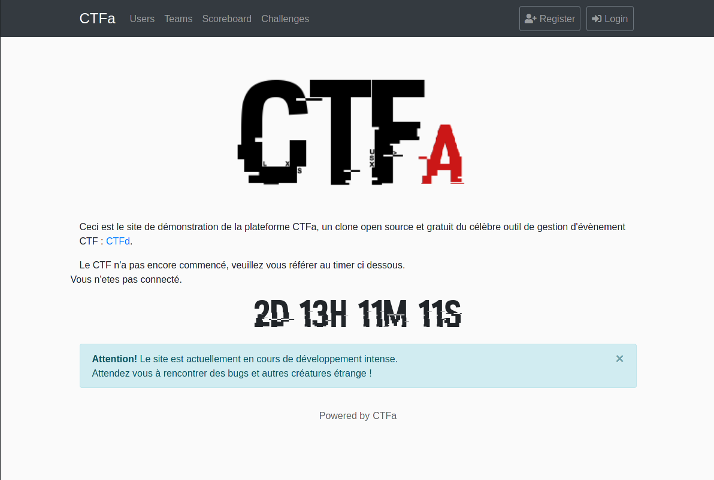
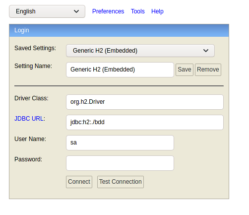

# CTFa
A platform to manage and organize a jeopardy-style CTF.

## Dummy data setup

In order to try the project and make it run with dummy random data, `cd` in the project folder then run :

```bash
python setup_data.py
```

If everything went fine you should be presented with a similar result :



This script is made to generate a populating script for the H2 database. The only thing left to do is to run the project.

> Note : this script creates random and semi-random data. If the results in the scoreboard are not good enough just run this script again and reload the server

## Starting the server

### Using IntelliJ IDEA

The easiest way to start the project is to open it with [IntelliJ IDEA](https://www.jetbrains.com/idea/). Then as there is already a `.idea` folder with the configuration you only have to click on the green arrow to start the server :


Once you see those lines :



you are ready to go!

### Using the CLI

Using the command line interface, you need to have [maven](https://maven.apache.org/) installed. `cd` into the project folder. Then you need to clean the build folder, package the app and then run the server : 

```bash
mvn clean
mvn package
java -jar target/ctfa-0.0.1-SNAPSHOT.jar
```

Once you see those lines :


you are ready to go!

## Reaching the frontend

Once the server (backend) has started you may reach the index page on the following link : [http://localhost:9090/](http://localhost:9090/).



And as the project uses an H2 database you may access the h2 console on the following link: [http://localhost:9090/h2/](http://localhost:9090/h2/). You then can login using the following parameters :



```
Driver class: org.h2.Driver
JDBC URL: jdvc:h2:./bdd
User Name: sa
Password: (empty)
```

The h2 console allow the sysadmin to check the content of the database.

## Default accounts

Every account on this project have the following password : `123456789`.

Moreover there is two other accounts to try the rights system with an `user` and an `admin` account with the following credentials :

```
username: user
password: user

username: admin
password: admin
```

